# 阿布量化系统 (AbuQuant) - AI 上下文索引

> 更新时间：2025-12-27 12:20:52
> 版本：0.4.0

## 项目愿景

阿布量化（AbuQuant）是一个综合性的量化交易系统，旨在通过 AI 大数据、机器学习技术以及经典技术分析方法，为股票、期货、数字货币等多种金融投资品提供量化分析和回测能力。系统的核心设计理念是**"道生一、一生二、二生三、三生万物"**，从基础策略开始，通过模块化设计和灵活组合，衍生出无限可能的交易策略。

系统特别强调**非编程用户**的使用体验，通过图形化界面（abupy_ui）和智能化的量化分析，让普通投资者也能跨越复杂的代码量化阶段，迈向量化2.0时代。

## 架构总览

阿布量化采用**"道-一-二-三"**的三层架构设计：

### 核心架构层次

1. **道（Core）** - `abupy/CoreBu/`
   - 环境配置、基础类定义、并行处理框架
   - 全局枚举类型：市场类型、数据获取模式、存储类型等
   - 向后兼容性处理（py2/py3 兼容）

2. **一（Market & Trade）** - `abupy/MarketBu/`, `abupy/TradeBu/`
   - 数据获取：支持A股、美股、港股、期货、数字货币
   - 交易执行：订单管理、资金管理、K线数据管理
   - 基准对比：市场指数基准

3. **二（Factor & Alpha）** - `abupy/FactorBuyBu/`, `abupy/FactorSellBu/`, `abupy/AlphaBu/`
   - 买入择时因子：突破、趋势、均线等多种策略
   - 卖出择时因子：止盈止损、风险控制策略
   - 选股策略：股票筛选因子

4. **三（Intelligence）** - `abupy/MLBu/`, `abupy/UmpBu/`, `abupy/DLBu/`
   - 机器学习：分类、回归、无监督学习
   - UMP裁判系统：主裁、边裁决策拦截
   - 深度学习：图像识别模式（可选）

### 技术特点

- **多市场支持**：A股、美股、港股、期货（国内外）、比特币、莱特币
- **多进程并行**：支持多进程/多线程数据获取和策略回测
- **AI智能优化**：通过机器学习训练裁判模型，拦截不良交易
- **技术分析集成**：缠论、波浪理论、谐波理论、K线形态、均线信号、技术指标
- **图形化界面**：提供 IPython Widget 交互界面

## 模块结构图

```mermaid
graph TD
    A["(根) 阿布量化系统"] --> B["abupy 核心库"];
    A --> C["abupy_lecture 教程"];
    A --> D["abupy_ui 图形界面"];
    A --> E["ipython 书籍示例"];
    A --> F["python 书籍示例"];

    B --> B1["CoreBu 核心基础"];
    B --> B2["MarketBu 市场数据"];
    B --> B3["TradeBu 交易执行"];
    B --> B4["FactorBuyBu 买入因子"];
    B --> B5["FactorSellBu 卖出因子"];
    B --> B6["AlphaBu 择时选股"];
    B --> B7["BetaBu 仓位管理"];
    B --> B8["MLBu 机器学习"];
    B --> B9["UmpBu 裁判系统"];
    B --> B10["MetricsBu 度量评估"];
    B --> B11["IndicatorBu 技术指标"];
    B --> B12["SimilarBu 相关性"];
    B --> B13["TLineBu 趋势线"];
    B --> B14["SlippageBu 滑点"];
    B --> B15["PickStockBu 选股"];
    B --> B16["WidgetBu 界面组件"];
    B --> B17["UtilBu 工具类"];
    B --> B18["DLBu 深度学习"];
    B --> B19["CrawlBu 数据爬虫"];
    B --> B20["CheckBu 参数检查"];
    B --> B21["ExtBu 扩展库"];

    click B1 "./abupy/CoreBu/CLAUDE.md" "查看核心基础模块"
    click B2 "./abupy/MarketBu/CLAUDE.md" "查看市场数据模块"
    click B3 "./abupy/TradeBu/CLAUDE.md" "查看交易执行模块"
    click B4 "./abupy/FactorBuyBu/CLAUDE.md" "查看买入因子模块"
    click B5 "./abupy/FactorSellBu/CLAUDE.md" "查看卖出因子模块"
    click B6 "./abupy/AlphaBu/CLAUDE.md" "查看择时选股模块"
    click B7 "./abupy/BetaBu/CLAUDE.md" "查看仓位管理模块"
    click B8 "./abupy/MLBu/CLAUDE.md" "查看机器学习模块"
    click B9 "./abupy/UmpBu/CLAUDE.md" "查看裁判系统模块"
    click B10 "./abupy/MetricsBu/CLAUDE.md" "查看度量评估模块"
```



## 模块索引

| 模块名称 | 路径 | 主要职责 | 文档状态 |
|---------|------|---------|---------|
| **CoreBu** | `abupy/CoreBu/` | 核心基础、环境配置、并行处理 | 已创建 |
| **MarketBu** | `abupy/MarketBu/` | 市场数据、股票代码、数据源 | 已创建 |
| **TradeBu** | `abupy/TradeBu/` | 交易执行、订单、资金管理 | 已创建 |
| **FactorBuyBu** | `abupy/FactorBuyBu/` | 买入择时因子策略 | 已创建 |
| **FactorSellBu** | `abupy/FactorSellBu/` | 卖出择时因子策略 | 已创建 |
| **AlphaBu** | `abupy/AlphaBu/` | 择时、选股主控模块 | 已创建 |
| **BetaBu** | `abupy/BetaBu/` | 仓位管理策略 | 已创建 |
| **MLBu** | `abupy/MLBu/` | 机器学习封装 | 已创建 |
| **UmpBu** | `abupy/UmpBu/` | UMP裁判决策系统 | 已创建 |
| **MetricsBu** | `abupy/MetricsBu/` | 回测结果度量评估 | 已创建 |
| **IndicatorBu** | `abupy/IndicatorBu/` | 技术指标计算 | 已创建 |
| **SimilarBu** | `abupy/SimilarBu/` | 相关性分析 | 已创建 |
| **TLineBu** | `abupy/TLineBu/` | 趋势线分析 | 已创建 |
| **SlippageBu** | `abupy/SlippageBu/` | 滑点模拟 | 已创建 |
| **PickStockBu** | `abupy/PickStockBu/` | 选股策略 | 已创建 |
| **WidgetBu** | `abupy/WidgetBu/` | IPython界面组件 | 已创建 |
| **UtilBu** | `abupy/UtilBu/` | 工具函数集合 | 已创建 |
| **DLBu** | `abupy/DLBu/` | 深度学习模块 | 已创建 |
| **CrawlBu** | `abupy/CrawlBu/` | 雪球数据爬虫 | 已创建 |
| **CheckBu** | `abupy/CheckBu/` | 参数检查装饰器 | 已创建 |
| **ExtBu** | `abupy/ExtBu/` | 第三方扩展库 | 已创建 |

## 运行与开发

### 环境要求

```bash
# 推荐使用 Anaconda 部署
conda create -n abupy python=3.7
conda activate abupy

# 安装依赖
pip install numpy pandas scikit-learn matplotlib seaborn
pip install ipython jupyter notebook
```

### 快速开始

```python
import abupy
from abupy import abu, EMarketTargetType

# 设置市场类型（美股、A股、港股）
abupy.env.g_market_target = EMarketTargetType.E_MARKET_TARGET_US

# 定义买入因子
buy_factors = [
    {'xd': 60, 'class': abupy.AbuFactorBuyBreak},
    {'xd': 42, 'class': abupy.AbuFactorBuyBreak}
]

# 定义卖出因子
sell_factors = [
    {'stop_loss_n': 0.5, 'stop_win_n': 3.0, 'class': abupy.AbuFactorAtrNStop}
]

# 运行回测
abu_result, kl_pd_manager = abu.run_loop_back(
    read_cash=1000000,
    buy_factors=buy_factors,
    sell_factors=sell_factors,
    n_folds=2
)
```

### 主入口

- **`abupy/abu.py`**: 主回测入口 `run_loop_back()`
- **`abupy/__init__.py`**: 包初始化，导出所有公共模块

## 测试策略

### 测试现状

- 项目**未发现传统单元测试**（无 `test_*.py` 或 `*_test.py` 文件）
- 测试主要通过 **Jupyter Notebook 教程**进行验证
- 位于 `abupy_lecture/` 目录下的 32 个教程 Notebook 即为功能验证

### 手动测试流程

1. **教程验证**: 运行 `abupy_lecture/` 中的 Notebook
2. **沙盒测试**: 使用 `MarketBu/ABuMarket.py` 中定义的沙盒股票池
   - 美股: `['usTSLA', 'usNOAH', 'usSFUN', 'usBIDU', 'usAAPL', 'usGOOG', 'usWUBA', 'usVIPS']`
   - A股: `['sz002230', 'sz300104', 'sz300059', 'sh601766', ...]`
   - 港股: `['hk03333', 'hk00700', 'hk02333', ...]`

## 编码规范

### 命名约定

- **模块**: `ABu` 前缀 + 功能缩写，如 `ABuMarket`, `ABuTrade`
- **类**: `Abu` 前缀 + 功能描述，如 `AbuCapital`, `AbuOrder`
- **函数**: 小写 + 下划线，如 `run_loop_back`, `make_orders_pd`
- **常量**: 大写 + 下划线，如 `K_SAND_BOX_US`, `E_MARKET_TARGET_US`

### 代码风格

- **Python 2/3 兼容**: 使用 `six` 库和 `from __future__ import`
- **文档字符串**: 每个模块开头包含 `__author__ = '阿布'`, `__weixin__ = 'abu_quant'`
- **类型标注**: 使用 Enum 定义枚举类型（如 `EMarketTargetType`）

### 模块职责

每个 Bu (Business Unit) 模块职责单一，接口清晰：
- **Bu 后缀**: 表示业务单元模块
- **Mixin**: 混入类，提供可复用的功能片段
- **Base**: 基类，定义抽象接口

## AI 使用指引

### 核心工作流程

1. **数据准备** (`MarketBu`)
   - 使用 `abu.run_kl_update()` 更新市场数据
   - 数据源支持：本地缓存、网络 API（雪球等）

2. **策略定义** (`FactorBuyBu`, `FactorSellBu`, `PickStockBu`)
   - 买入因子：突破、趋势、多均线等
   - 卖出因子：ATR止盈止损、N日卖出等
   - 选股因子：价格范围、角度筛选等

3. **回测执行** (`CoreBu.ABu.run_loop_back`)
   - 多进程并行执行择时
   - 资金管理与仓位控制
   - 滑点与手续费模拟

4. **结果评估** (`MetricsBu`)
   - 收益率、夏普比率、最大回撤
   - 可视化分析图表

5. **智能优化** (`MLBu`, `UmpBu`)
   - 训练裁判模型拦截不良交易
   - 机器学习优化策略参数

### AI 辅助开发建议

1. **策略开发**: 从 `FactorBuyBu/ABuFactorBuyBase.py` 继承创建新策略
2. **数据源扩展**: 在 `MarketBu/ABuDataSource.py` 中添加新的数据源
3. **度量指标**: 在 `MetricsBu/ABuMetricsBase.py` 中添加自定义度量
4. **裁判系统**: 继承 `UmpBu/ABuUmpBase.py` 创建新的拦截规则

### 常见任务

```python
# 查询股票信息
from abupy import abupy
symbol = abupy.code_to_symbol('usTSLA')

# 获取K线数据
from abupy.MarketBu import ABuSymbolPd
kl_df = ABuSymbolPd.get_price('usTSLA', start='2020-01-01', end='2023-12-31')

# 计算技术指标
from abupy.IndicatorBu import ABuNDMa
ma20 = ABuNDMa.calc_ma(kl_df, ma_period=20)

# 相关性分析
from abupy.SimilarBu import ABuSimilar
similar = ABuSimilar.find_similar_with_se('usTSLA', n_folds=10)
```

## 变更记录

### 2025-12-27 12:20:52 - 初始化 AI 上下文
- 完成项目架构分析
- 创建根级 CLAUDE.md 文档
- 创建 21 个模块级 CLAUDE.md 文档
- 识别出 21 个核心业务模块 (Bu)
- 统计文件结构：约 250+ Python 文件
- 覆盖率：核心模块 100%，教程文档完整，测试覆盖率待提升

---

*提示：点击上方 Mermaid 图表中的节点可快速跳转到对应模块的详细文档。*
